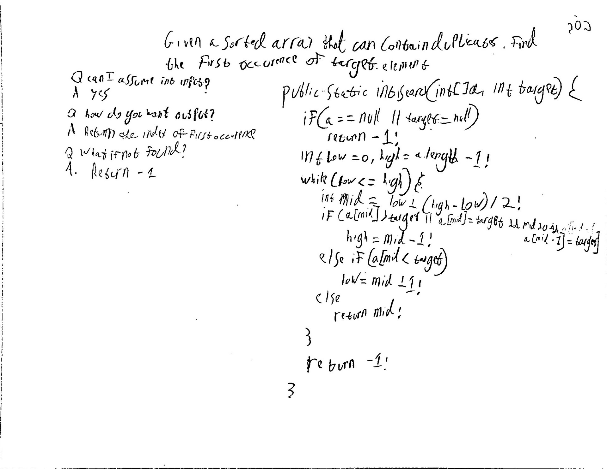

## First Occurrence

Given a sorted array that can contain duplicates, find the first occurrence of the target element. For example:
A = \[1,3,4,6,6,6,7\] and Target = 6, return index 3.

**Level**: Easy

Questions to Clarify:
Q. Can I assume that the input is an integer array?
A. Yes

Q. How do you want the output?
A. Return the index of the first occurrence.

Q. What do do if target was not found?
A. Return -1

## Solution

If the mid is not the first occurrence of the target, you treat it like a greater element, i.e, continue your search in the lower half.

To check if a mid is the first occurrence, you check if mid-1 is the same as mid.

**Pseudocode:**

```
low = 0, high = a.length-1
while low <= high
    find mid
    if mid > target or mid is target but not the 1st occurence
        high = mid -1
    else if mid < target
        low = mid + 1
    else
        return mid // mid must be first occurence

return -1 // not found
```

Test Cases:
Edge Cases: empty array, null array
Base Cases: single element, 2 equal elements (target missing/present)
Regular Cases: only equal elements, no duplicate elements, normal case

Time Complexity: O(log(n))
Space Complexity: O(1)

**code:**

```java
public static int search(int[] a, int target) {
    if (a == null || target == null)
        return -1;
    
    int low = 0, high = a.legnth - 1;

    while (low <= high) {
        int mid = low + (high - low)/2;
        if (a[mid] > target
                || (a[mid] == target && mid > 0 && a[mid -1] == target)) {
            high = mid -1;
        } else if (a[mid] < target) {
            low = mid + 1;
        } else {
            return mid;
        }
    }

    return -1;
}
```

