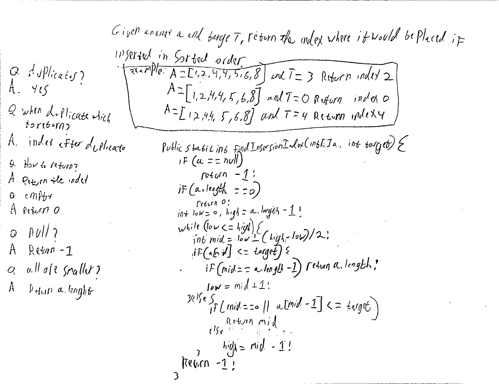

## Find Insertion Index

**Level**: Easy

You are given a sorted array A and a target T. Return the index where it would be placed if inserted in order.
For example,
A = \[1,2,4,4,5,6,8\] and T = 3, return index 2
A = \[1,2,4,4,5,6,8\] and T = 0, return index 0
A = \[1,2,4,4,5,6,8\] and T = 4, return index 4 (insert after other 4’s).

Questions to Clarify:
Q. Can there be duplicates?
A. Yes, there can be duplicates.

Q. If T has duplicates (like in example 3 above), which index do we return?
A. Return the index after the duplicate elements.

Q. How do you want to return the output?
A. Return the index where T will go.

Q. If the array is empty, should we return 0?
A. Yes

Q. What do we return if the array is null?
A. Return -1

Q. What do we return if all elements are smaller than T?
A. Return A.length, because that is where T should go.

## Solution

We can narrow down the problem to: "Given an array A and Target T, Find thr first element larger than T." This will give us the index where T goes. We need to take care of the following edge cases. 1. if the input array is empty. 2.all the elements are larger than target return 0. 3. if all elements are less than taget return a.length.

**Pseudocode**:

```
low = 0, high = a.length -1
while low <= high
    find mid
    if a[mid] <= target
        if mid is last element of array return a.length
        else go right
    else // a[mid] > target
        if (mid == 0 || a[mid-1] <= target)
            return mid      // found result
        else go left

return -1 // should not happen
```

**Test Cases**:
Edge Cases: empty array, null array
Base Cases: single element (equal/not-equal to target)
Regular Cases: has target (single, multiple), doesn't have target,
all elements are smaller/larger than target

Time Complexity: O(log(n))
Space Complexity: O(1)

**code:**

```
public static int findInsertionIndex(int[] a, int target) {
    if (a == null)
        return -1;

    if (a.length == 0)
        return 0;

    int low = 0, high = a.length - 1;
    while (low <= high) {
        int mid = low + (high - low)/2;
        if (a[mid] <= target) {
            if (mid == a.length -1)
                return a.length;
            low = mid + 1;
        } else {
            if (mid == 0 || a[mid - 1] <= target)
                return mid;
            high = mid -1;
        }
    }

    return -1; //should not happen
}
```

