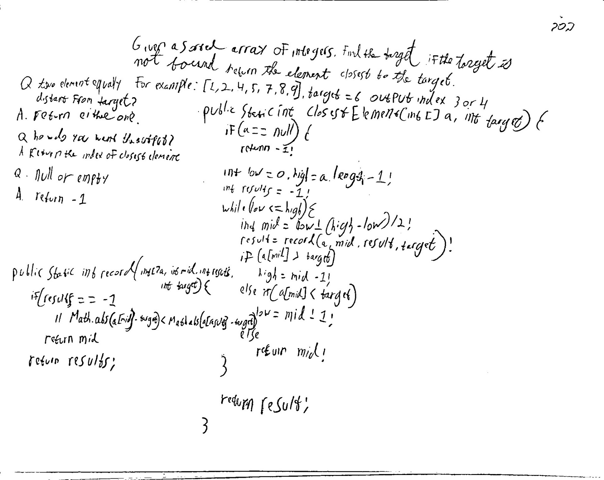

## Record and Move On

**Level**: Easy

Given a sorted array of Integers, find the target. If the target is not found, return the element closest to the target.
For example,
A = \[1,2,4,5,7,8,9\], Target = 6 -> Output Index = 3 or 4 (since both 5 and 7 are equally close)

Questions to Clarify:
Q. What if there are two elements equally distant from target?
A. Return either one.

Q. How do you want to return the output?
A. Return the index of the closest element.

Q. What to return if array is empty or null?
A. Return -1.

## Solution

Every time we find a new mid we are moving closer to target.
if we keep track of the closet mid we have encountered, that will give us closest element to the target.

**Pseudocode**:

```
result = null
while low <= high
    find min
    if result is null or mid is closer to target than previous result
        reassign result to mid
    continue with binary search steps
```

**Test Cases**:
Edge Cases: empty array, null array
Base Cases: single element (equal/not-equal to target)
Regular Cases: has equal element, no equal element, closer element at end/beginning

Time Complexity: O(log(n))
Space Complexity: O(1)

**code:**

```
public static int closestElement(int[] a, int target) {
    if (a == null) {
        return -1;
    }

    int low = 0, high = a.length -1;
    int results = -1;
    while (low <= high) {
        int mid = low + ((high - low) >> 1);
        results = record(a, mid, results, target);
        if (a[mid] > target) {
            high = mid - 1;
        } else if (a[mid] < target) {
            low = mid + 1;
        } else {
            return mid;
        }
    }

    return results;
}

private static int record(int[] a, int mid, int results, int target) {
    if (results == -1
            || Math.abs(a[mid] - target) < Math.abs(a[results] - target))
        return mid;

    return results;
}

```

