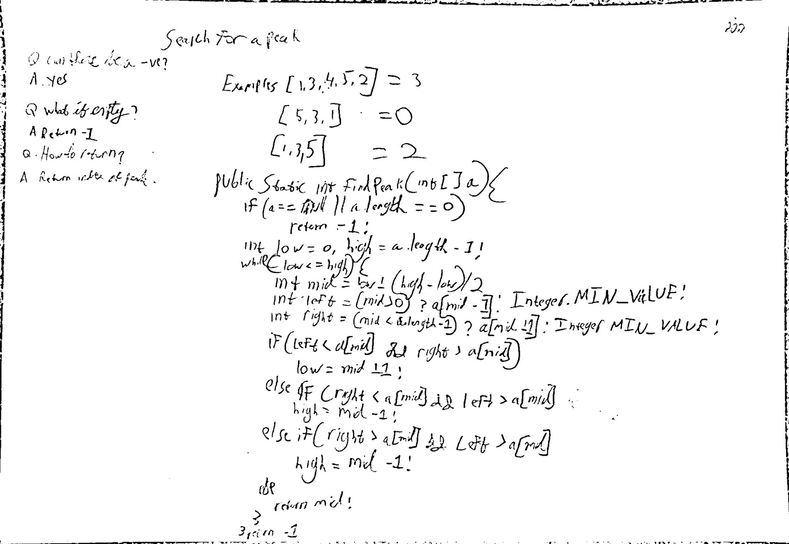

## Search for a peak

**Level**: Medium

A peak element in an array A is an A\[i\] where its neighboring elements are less than A\[i\].
So, A\[i - 1\] < A\[i\] and A\[i + 1\] < A\[i\].
Assume there are no duplicates. Also, assume that A\[-1\] and A\[length\] are negative infinity (-∞).
So A\[0\] can be a peak if A\[1\] < A\[0\].
A = \[1,3,4,5,2\] => Peak = 5
A = \[5,3,1\] => Peak = 5
A = \[1,3,5\] => Peak = 5

Questions to Clarify:
Q. Can there be negative numbers in the array?
A. Yes, there can be both -ve and +ve numbers

Q. How do we return the output?
A. Return the index of a peak.

Q. What if the array is empty or null?
A. Return -1.

## Solution

Any element can lead us to a peak. Just follow the slope up using binary search.
There are two exceptions if an element is a peak or a valley.
If it's a peak we found the answer. If it's a valley we can go in any direction.

**Pseudocode**:

```
low = 0, high = a.length -1
while low <= high
    find mid
    left = left neighber of mid (-Infinity if out of bounds)
    right = right neighber of mid (-Infinity if out of bounds)

    if left, mid right are sloping up towards right
        go right
    else if left, mid, right are slopping up towards left
        go left
    else if mid is a valley
        go either way
    else
        return mid // mid must be peak

return -1 // not found, should not happen
    
```

**Test Cases**:
Edge Cases: empty array, null array
Base Cases: single element
Regular Cases: peak in the middle, peak at a\[0\], peak at end of array

Time Complexity: O(log(n))
Space Complexity: O(1)

**code:**

```java
public static int findPeak(int[] a) {
    if (a == null || a.length == 0)
        return -1;
       
    int low = 0, high = a.length - 1;

    while (low <= high) {
        int mid = low + (high - low)/2;

        int left = (mid > 0) ? a[mid-1] : Integer.MIN_VALUE;
        int right = (mid < a.length-1) ? a[mid+1] : Integer.MIN_VALUE;

        if (left < a[mid] && right > a[mid]) {
            low = mid + 1; // go right
        } else if (right < a[mid] && left > a[mid]) {
            high = mid - 1; // go left
        } else if (right > a[mid] && left > a[mid]) {
            high = mid - 1; // valley, go either way
        } else {
            return mid;
        }
    }

    return -1; // should not happen
}

```

