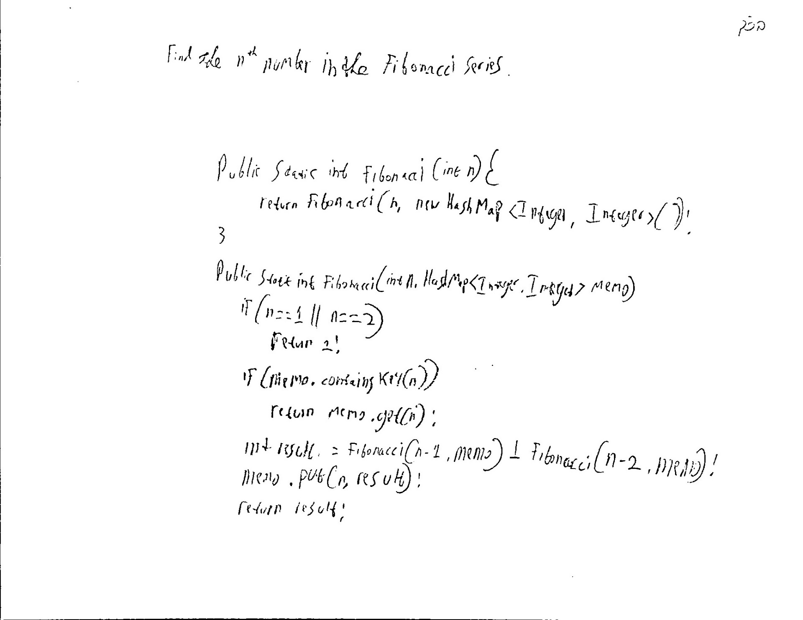

## Fibonacci

**Level**: Very Easy

Find the n<sup>th</sup> number in the Fibonacci series. Fibonacci series is as follows:

1, 1, 2, 3, 5, 8, 13, 21, ..

After the first two 1’s, each number is the sum of the previous two numbers.

## Solution

**Without Memoization**:
Time Complexity: O(2<sup>n</sup>)
Space Complexity: O(n)

```java
public static int (fibonacci(int n) {
    if ( n==1 || n == 2)
        return 1;
    return fibonacci(n-1) + fibonacci(n-2);
}
```

**Without Memoization**:
Time Complexity: O(n)
Space Complexity: O(n)

```java
public static int fibonacci(int n) {
    return fibonacci(n, new HashMap<Integer, Integer>());
}

public static int fibonacci(int n, HashMap<Integer, Integer> memo) {
    if (n == 1 || n == 2)
        return 1;
    if (memo.containsKey(n))
        return memo.get(n);

    int result = fibonacci(n - 1, memo) + fibonacci(n - 2, memo);
    memo.put(n, result);
    return result;
}
```

