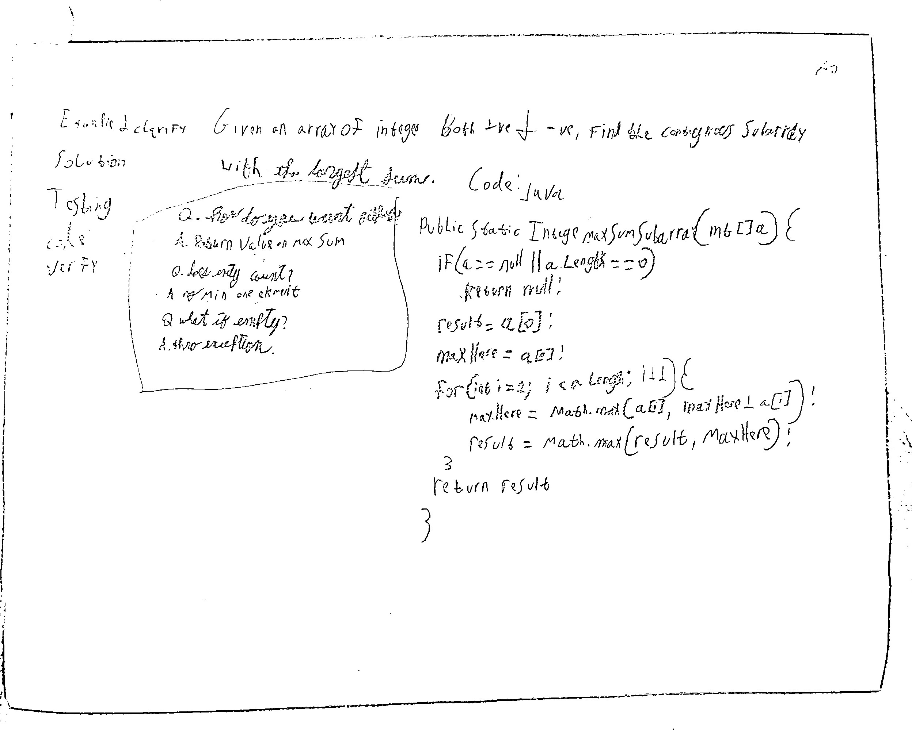

## Maximun Sum Subarray

**Level**: Medium 

Given an array of integers that can be both +ve and -ve, find the contiguous subarray
with the largest sum.  
For example: [1,2,-1,2,-3,2,-5] -> first 4 elements have the largest sum. Return (0,3)


Questions to Clarify:  
Q. How do you want the output?  
A. Return the value of the maximun sum.  

Q. Do empty arrays count as a subarray?  
A. No, the subarray should have at least 1 elemnet.  

Q. But What if the input array is empty or null?  
A. Throw an exception.  

## Solution
Applying the brute force method of a nested loop  will find the solution in a big O(n^2). The interviewer asked for big O(n). We can achieve that by applying the Kadane's algorithm. If we know the max sum of a[i] - either a[i] as a single element, or a[i] + max ending at a[i-1]. We can calculate the max sum ending at a[i]. We can take this throughout the array.

**Pseudocode**:
```
result = a[0], maxEndingHere = a[0]
for i is 1 through a.length
    maxEndingHere = Max(a[i], maxEndingHere + a[i])
    result = max(result, maxEndingHere)
return result

```
**Test Cases**:
Edge Cases: empty array, null array  
Base Cases: single element (+ve, 0, -ve), two elements  
Regular Cases: all -ve, all +ve, mix -ve and +ve, all 0s  

Time Complexity: O(n)  
Space Complexity: O(1)  

**Code:**
```java
public static Integer MaximunSumSubarray(int[] a) {
    if (a == null || a.length == 0)
        throw new IllegalArgumentException("Input array is empty or null");

    int result = a[0], maxEndingHere= a[0];

    for (int i = 1; i < a.length; i++) {
        maxEndingHere = Math.max(maxEndingHere + a[i], a[i]);
        result = Math.max(result, maxEndingHere);
    }
    return result;
}
```
