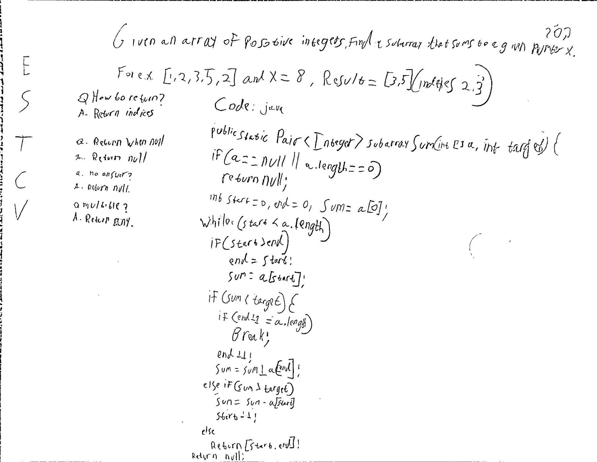

## Subarray Sum

**Level**: Medium

Given an array of positive integers, find a subarray that sums to a given number X.
For e.g, input = \[1,2,3,5,2\] and X=8, Result = \[3,5\] (indexes 2,3)

Questions to Clarify:
Q. How to return result?
A. Return start and end indices.

Q. What to return if null?
A. Return null.

Q. What to return if no subarray is found?
A. Return null.

Q. What to do if there are multible subarrays?
A. Return any one.

## Solution

The brute force method will take big O(n^2) we want big O(n).
We can use the sliding window technique. Two pointers start and end both start at 0. If the sum is less than target we advance end and add a\[end\] to sum. If sum is greater than target we advance start and subtract a\[start\] from sum. Keep in mind start is always behind or equal to to end.

**Pseudocode**:

```
if a is null or a.length is 0 
    return null
    
start = 0, end = 0, sum = a[0]

while start is within the array
    if start inched ahead of end
        bring end back to start, update sum to a[start]

    if sum < target
        if end + 1 end of array
            break
        end++
        sum = sum + a[end]
    else if sum > target
        sum = sum - a[start]
        start++
    else
        return [start, end]

return null
```

**Test Cases**:
Edge Cases: empty array, null array
Base Cases: single element (more/less/equal to X)
Regular Cases: two elements, no sum equals to X, etc.

Time Complexity: O(n)
Space Complexity: O(1)

**Code:**

```
public static Pair<Integer> subarraySum(int[] a, int target) {
    if (a == null || a.length == 0)
        return null;

    int start = 0, end = 0, sum = a[0];
    
    while (start < a.legnth) {
        if (start > end) {
            end = start;
            sum = a[start];
        }

        if (sum < target) {
            if (end + 1 == a.length)
                break;
            end++;
            sum = sum + a[end];
        } else if (sum > target) {
            sum = sum - a[start];
            start++;
        } else {
            return new Pair<Integer>(start, end);
        }
    }

    return null;
}
```




