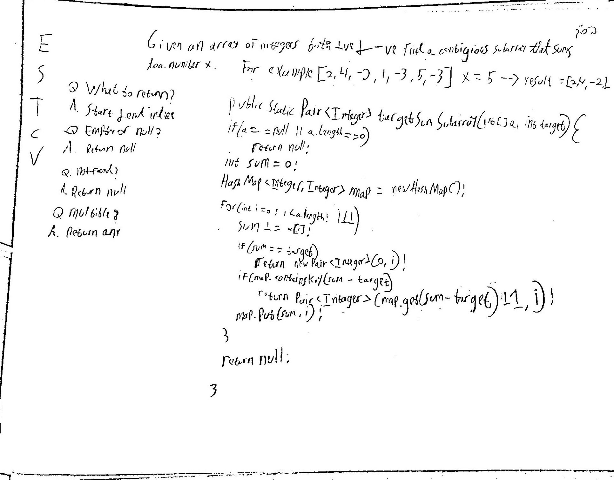

## Target Sum Subarray

**Level**:  Medium

Given an array of integers, both -ve and +ve, find a contiguous subarray that sums to a number X.  
For example: [2,4,-2,1,-3,5,-3], X = 5 --> Result = [2,4,-2,1]  

Questions to Clarify:
Q. How should I return the output?  
A. Return the starting and ending indices of the subarray.  

Q. What to return if the array is empty or null?  
A. Return null.  

Q. What to return if no subarray is found?  
A. Return null.  

Q. What to do if there are multiple subarrays?  
A. Return any one.  


## Solution
We use the prefix sum technique. For each element we calculate the sum - from a[0] to a[i] and store it in a hashmap. If the sum is target our answer is a[0]..a[i].
If no element equal target, If we have previously encountered current_prefix_sum-x, i.e. it is in our hash map at some index p, that means a[p+1..i] is our results.
**Pseudocode**:
```
sum = 0, map = new HashMap

for i in a.length   
    sum += a[i]

    if sum == target
        return Pair 0..i

    if map has sum-target
        return Pair map.get(sum-target)+1..i

    add(sum, i) to map.

if found nothing return null
```

**Test Cases**:
Edge Cases: Empty Array, Null array  
Base Cases: single element (-ve, +ve, 0)  
Regular Cases: has sum, does not have sum, has sum at beginning/end/middle  

Time Complexity: O(n)  
Space Complexity: O(n)  

**code:**
```java
public static Pair<Integer> targetSumSubarray(int[] a, int target) {
    if (a == null || a.length == 0)
        return null;

    int sum = 0;
    HashMap<Integer, Integer> map = new HashMap<>();

    for(int i = 0; i < a.length; i++) {
        sum += a[i];

        if (sum == target) {
            return new Pair<Integer>(0,i);
        }
        
        if (map.containsKey(sum - target)) {
                return new Pair<Integer>(map.get(sum - target) + 1, i);
        }

        map.put(sum, i);
    }

    return null; // not found
}
```




