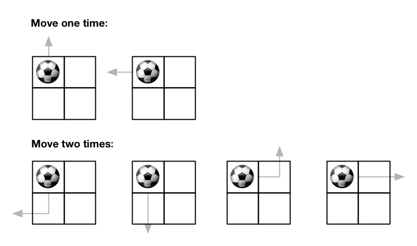

576\. Out of Boundary Paths

Medium

There is an `m x n` grid with a ball. The ball is initially at the position `[startRow, startColumn]`. You are allowed to move the ball to one of the four adjacent cells in the grid (possibly out of the grid crossing the grid boundary). You can apply **at most** `maxMove` moves to the ball.

Given the five integers `m`, `n`, `maxMove`, `startRow`, `startColumn`, return the number of paths to move the ball out of the grid boundary. Since the answer can be very large, return it **modulo** `10<sup>9</sup> + 7`.

**Example 1:**



```
Input: m = 2, n = 2, maxMove = 2, startRow = 0, startColumn = 0
Output: 6

```

**Example 2:**


```
Input: m = 1, n = 3, maxMove = 3, startRow = 0, startColumn = 1
Output: 12

```

**Constraints:**

- `1 <= m, n <= 50`
- `0 <= maxMove <= 50`
- `0 <= startRow < m`
- `0 <= startColumn < n`

**Solution:**
```python
class Solution:
    def findPaths(self, m: int, n: int, maxMove: int, startRow: int, startColumn: int) -> int: 
        result = self._findPaths(m, n, maxMove, startRow, startColumn, {})
        return result % 1000000007
    
    
    def _findPaths(self, m: int, n: int, maxMove: int, r: int, c: int, memo: dict) -> int:
        key = (maxMove, r, c)
        if key in memo:
            return memo[key]
        
        row_inbounds = 0 <= r < m
        col_inbounds = 0 <= c < n
        if not row_inbounds or not col_inbounds:
            return 1
        
        if maxMove == 0:
            return 0
        
        total_count = 0
        deltas = [(0, 1), (0, -1), (1, 0), (-1, 0)]
        for delta in deltas:
            d_row, d_col = delta
            total_count += self._findPaths(m, n, maxMove - 1, r + d_row, c + d_col, memo)
            
        memo[key] = total_count
        return memo[key]