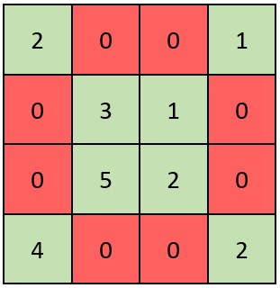

2319\. Check if Matrix Is X-Matrix

Easy

A square matrix is said to be an **X-Matrix** if **both** of the following conditions hold:

1.  All the elements in the diagonals of the matrix are **non-zero**.
2.  All other elements are 0.

Given a 2D integer array `grid` of size `n x n` representing a square matrix, return `true` *if* `grid` *is an X-Matrix*. Otherwise, return `false`.

**Example 1:**



```
Input: grid = [[2,0,0,1],[0,3,1,0],[0,5,2,0],[4,0,0,2]]
Output: true
Explanation: Refer to the diagram above. 
An X-Matrix should have the green elements (diagonals) be non-zero and the red elements be 0.
Thus, grid is an X-Matrix.

```

**Example 2:**


```
Input: grid = [[5,7,0],[0,3,1],[0,5,0]]
Output: false
Explanation: Refer to the diagram above.
An X-Matrix should have the green elements (diagonals) be non-zero and the red elements be 0.
Thus, grid is not an X-Matrix.

```

**Constraints:**

- `n == grid.length == grid[i].length`
- `3 <= n <= 100`
- `0 <= grid[i][j] <= 10<sup>5</sup>`

Accepted

22,611

Submissions

33,668

Seen this question in a real interview before?

[Matrix Diagonal Sum](https://leetcode.com/problems/matrix-diagonal-sum/)

Easy

Assuming a 0-indexed matrix, for a given cell on row i and column j, it is in a diagonal if and only if i == j or i == n - 1 - j.

We can then iterate through the elements in the matrix to check if all the elements in the diagonals are non-zero and all other elements are zero

**Solution:**

```python
class Solution:
    def checkXMatrix(self, grid: List[List[int]]) -> bool:
        for i in range(len(grid)):
            for j in range(len(grid[0])):
                if i == j or i == len(grid) - 1 -j:
                    if grid[i][j] == 0:
                        return False
                else:
                    if grid[i][j] != 0:
                        return False
        return True
```

Time Complexity: O(r\*c)
Space Complexity: O(r\*c)